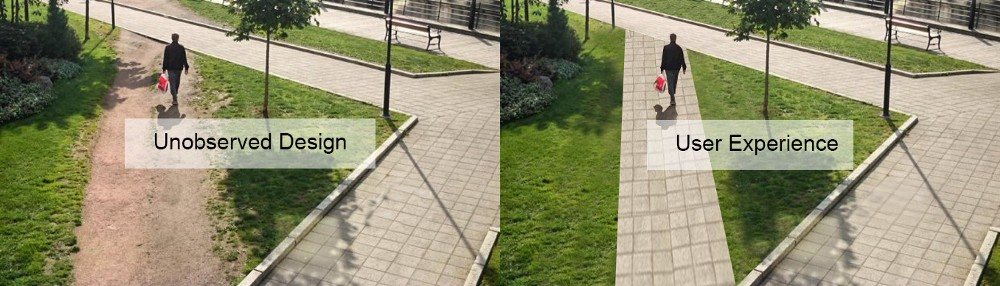

<!-- _paginate: false -->
<!-- _footer: "" -->

---

# UX __User Experience__

__UX__ (acronimo di User Experience) è una parola inglese che può essere tradotta come "esperienza utente" e si riferisce all'insieme delle sensazioni, emozioni, attitudini e opinioni che un individuo sperimenta quando utilizza un prodotto, servizio o sistema.

In ambito informatico, il termine UX viene spesso utilizzato per fare riferimento alla progettazione di interfacce utente intuitive, accattivanti e facili da usare, sia in ambito web che mobile. L'obiettivo della progettazione UX è quello di rendere l'utilizzo di un prodotto il più piacevole e soddisfacente possibile per gli utenti, al fine di aumentarne l'adozione e la fidelizzazione.

ChatGPT

---

---

# Trasformazione digitale

La UX fa parte di quelli che sono i processi di trasformazione digitale di un'azienda.

La trasformazione digitale è un percorso di crescita e la UX è un passo fondamentale di questo percorso.

---

# Centralità della trasformazione

Molte aziende hanno messo la UX al centro del proprio processo di comunicazione:

- Apple semplificando il design degli smartphone
- Google cambiando il modo col quale fare ricerca
- Facebook creando il concetto di social media

---

# Spendere in UX significa investire

Rendere semplice ed intuitivo un processo ne migliora l'efficacia e lo rende più produttivo

---

# Investimenti in UX

Uno studio del 2013 condotto da Forrester ha dimostrato che un miglioramento delle prestazioni di un sito web del 25% può aumentare le conversioni delle vendite del 74%.

Un altro studio del 2014 ha mostrato che il 74% degli utenti web considera la qualità dell'esperienza utente come il principale criterio di giudizio di un sito web.

Uno studio del 2015 ha scoperto che il 49% degli utenti web che hanno avuto un'esperienza negativa con un sito web sono meno propensi a comprare da quell'azienda in futuro.

Una ricerca del 2016 ha dimostrato che il 75% degli utenti giudica la credibilità di un'azienda sulla base dell'aspetto del suo sito web.

---

# Vantaggi

Questi sono solo alcuni esempi di come l'investimento in UX può avere un impatto positivo sulla performance di un'azienda. In generale, una buona UX può aumentare il tasso di conversione, ridurre il tasso di abbandono del carrello della spesa, aumentare la soddisfazione e la fedeltà degli utenti e migliorare la reputazione di un'azienda.

---

# AARRR - AA

AARRR è un acronimo che rappresenta un modello di crescita noto anche come "Pirate Metrics". Si tratta di una sequenza di cinque fasi fondamentali che un'azienda deve percorrere per ottenere successo:

Acquisizione (__Acquisition__): si tratta del primo contatto che gli utenti hanno con il prodotto o il servizio dell'azienda. In questa fase è importante individuare le fonti di traffico e le strategie di marketing più efficaci per attirare nuovi utenti.

Attivazione (__Activation__): si tratta della fase in cui gli utenti diventano attivi e iniziano a utilizzare il prodotto o il servizio. In questa fase è importante assicurare che gli utenti abbiano un'esperienza positiva e che comprendano come utilizzare il prodotto.

---

# AARRR - RRR

Retention (__Retention__): si tratta della fase in cui gli utenti continuano a utilizzare il prodotto o il servizio nel tempo. In questa fase è importante mantenere gli utenti interessati e soddisfatti, in modo da ridurre il tasso di abbandono.

Referral (__Referral__): si tratta della fase in cui gli utenti parlano del prodotto o del servizio ai loro amici e conoscenti. In questa fase è importante creare un prodotto o un servizio che sia talmente soddisfacente da spingere gli utenti a consigliarlo ad altre persone.

Revenue (__Revenue__): si tratta della fase in cui gli utenti generano entrate per l'azienda attraverso l'acquisto di prodotti o servizi o attraverso altre forme di monetizzazione. In questa fase è importante individuare le fonti di revenue più efficaci e implementare strategie per aumentare le entrate.

---

# Modello AARRR

Il modello AARRR viene spesso utilizzato in ambito startup per identificare le aree su cui l'azienda deve concentrarsi per ottenere crescita e successo a lungo termine.

---

# UX e Activation

Il primo impatto con l'azienda viene dato dalla UX di prodotto: è inutile investire in acquisizione utenti, se poi siamo carenti dal punto di vista dell'attivazione utenti

- Complessità
- Percorsi errati
- Mancanza di chiarezza

---

# Design di servizi

Come devono essere strutturati i servizi?

## Design thinking

Approccio basato su empatia, sperimentazione e creatività

## Service design

Efficienza dei servizi in base all'esperienza utente

## UX Design

Rendere intuitivi e facili da usare i servizi

---

# Design thinking

Il design thinking è un approccio metodologico alla risoluzione dei problemi e alla creazione di nuove soluzioni basato sull'empatia verso gli utenti, la sperimentazione rapida e il pensiero creativo.

Il design thinking si basa sull'idea che sia possibile trovare soluzioni innovative ai problemi attraverso il coinvolgimento attivo degli utenti e la sperimentazione di diverse opzioni. In questo modo, il design thinking cerca di coniugare la creatività con il pensiero strategico e l'analisi dei dati.

Occorre rompere la segregazione dei dipartimenti per trovare insieme nuove soluzioni.

---

# Service design

Il service design è una disciplina che si occupa della progettazione di servizi basati sull'esperienza utente (UX). Il service design si concentra sulla creazione di servizi efficienti, coerenti e soddisfacenti per gli utenti, tenendo conto di tutti gli aspetti che influiscono sulla loro esperienza di utilizzo.

Il service design si basa sulla comprensione delle esigenze e dei desideri degli utenti e mira a creare servizi che siano facili da utilizzare, intuitivi e che rispondano alle loro aspettative. Inoltre, il service design cerca di ottimizzare le interazioni tra gli utenti e il servizio, al fine di rendere l'esperienza il più piacevole e soddisfacente possibile.

Il service design viene utilizzato in molti settori, come il turismo, il trasporto, la sanità, il retail e molti altri, al fine di progettare servizi efficaci e soddisfacenti per gli utenti.

---

# UX Design

UX design è il processo di progettazione di prodotti, servizi o sistemi che tengono conto dell'esperienza utente. L'obiettivo dello UX design è quello di creare prodotti, servizi o sistemi che siano intuitivi, facili da usare e soddisfacenti per gli utenti, al fine di aumentarne l'adozione e la fidelizzazione.

Lo UX design si basa sulla comprensione delle esigenze, dei desideri e delle abitudini degli utenti, e utilizza metodi quali la ricerca, il testing e il design thinking per creare soluzioni che soddisfino queste esigenze. Inoltre, lo UX design tiene anche conto dell'impatto emotivo che un prodotto, un servizio o un sistema ha sugli utenti, al fine di creare un'esperienza coerente e piacevole.

Lo UX design viene spesso utilizzato in ambito informatico per progettare interfacce utente intuitive e accattivanti, sia in ambito web che mobile.

---

# Metriche 

Le metriche di valutazione del design sono degli strumenti che vengono utilizzati per misurare l'efficacia di un prodotto, di un servizio o di un sistema dal punto di vista dell'esperienza utente. 

---

# Metriche principali - 1 

Soddisfazione utente: si tratta di una misura della soddisfazione degli utenti rispetto al prodotto, al servizio o al sistema. La soddisfazione utente può essere misurata attraverso sondaggi o interviste a campione, o utilizzando strumenti di analisi delle prestazioni come il Net Promoter Score (NPS).

Tasso di conversione: si tratta di una misura del numero di utenti che completano un'azione desiderata (ad esempio, il completamento di un modulo di registrazione o l'acquisto di un prodotto) rispetto al numero totale di utenti che hanno visitato il sito.

---

# Metriche principali - 2

Tasso di abbandono: si tratta di una misura del numero di utenti che abbandonano il sito o l'applicazione prima di completare un'azione desiderata. Il tasso di abbandono può essere utilizzato per identificare problemi con la facilità d'uso o con la soddisfazione degli utenti.

Tempo di permanenza: si tratta di una misura del tempo che gli utenti trascorrono sul sito o sull'applicazione. Il tempo di permanenza può essere utilizzato per valutare l'interesse degli utenti per il contenuto o per il prodotto/servizio offerto.

Tasso di rimbalzo: si tratta di una misura del numero di utenti che lasciano il sito dopo aver visitato solo una pagina. Il tasso di rimbalzo può essere utilizzato per valutare l'attrattività del sito o dell'applicazione per gli utenti.

---

# UX ROI

UX ROI (acronimo di User Experience Return on Investment) si riferisce al ritorno economico ottenuto dall'investimento in UX (User Experience). Lo UX ROI può essere utilizzato per misurare il valore ottenuto da un progetto di UX o per confrontare il ritorno ottenuto da diversi progetti di UX.

Calcolare l'UX ROI può essere utile per determinare se un investimento in UX sia stato profittevole e per identificare le aree di UX su cui concentrarsi per ottenere il massimo ritorno. Tuttavia, il calcolo dell'UX ROI può essere complesso in quanto può essere difficile quantificare il valore dell'esperienza utente in termini monetari.

Per calcolare l'UX ROI, è necessario prima determinare il costo del progetto di UX e poi misurare l'impatto dell'investimento in UX sulla performance aziendale.

---

# UX ROI interno

Miglioramento dell'efficienza iterna

- Riduzione del tempo per effettuare un task
- Ridurre il numero degli errori di un utente col miglioramento di testi o con la scelta di immagini più intuitive
- Riduzione delle richieste di supporto
- Riduzione del tempo legato alla formazione

---

# Analisi dei dati

Occorrono degli strumenti per capire meglio come si stanno comportando gli utenti: dove si sbloccano, su quali pagine entrano ed escono dal sito e così via.

---

# Visual Analytics

Le __click head map__, le __scroll map__ e le __mouse movement heatmap__ sono tutte tecniche di visual analytics utilizzate per analizzare l'attività degli utenti su un sito web o su un'applicazione.

---

# Click heat map

Le __click heat map__ mostrano le aree del sito o dell'applicazione che vengono cliccate con maggiore frequenza dagli utenti. Le "click heat map" possono essere utilizzate per identificare le aree più popolari del sito o dell'applicazione e per valutare l'efficacia del layout delle pagine.

---

# Scroll map

Le __scroll map__ mostrano fino a che punto gli utenti scorrono una pagina del sito o dell'applicazione. Le "scroll map" possono essere utilizzate per valutare l'interesse degli utenti per il contenuto di una pagina e per identificare eventuali problemi di usabilità che potrebbero impedire agli utenti di accedere a tutto il contenuto.

---

# Mouse movement heatmap

Le __mouse movement heatmap__ mostrano i movimenti del mouse degli utenti durante la navigazione sul sito o sull'applicazione. Le "mouse movement heatmap" possono essere utilizzate per valutare l'attenzione degli utenti su determinate aree del sito o dell'applicazione e per identificare eventuali problemi di usabilità o di interesse degli utenti.

---

# Intervista contestuale

L'intervista contestuale è una tecnica di raccolta dei dati utilizzata nell'analisi UX (User Experience) per comprendere meglio come gli utenti interagiscono con un prodotto, un servizio o un sistema in contesto reale.

L'intervista contestuale consiste nel condurre un'intervista con gli utenti mentre questi utilizzano il prodotto, il servizio o il sistema in questione, al fine di ottenere una comprensione più approfondita delle loro esigenze, dei loro comportamenti e delle loro sfide.

Le interviste contestuali sono particolarmente utili per identificare problemi di usabilità o di soddisfazione degli utenti che potrebbero non essere evidenti attraverso gli analytics.

---

# ROI Esterno

- Impatto sulle vendite
- Impatto sulla fidelizzazione
- Acquisizione di nuovi lead
- Soddisfazione dei clienti

---

# Metriche - Conversion rate

Il conversion rate (tasso di conversione) è una metrica utilizzata per misurare il numero di utenti che completano un'azione desiderata (ad esempio, il completamento di un modulo di registrazione o l'acquisto di un prodotto) rispetto al numero totale di utenti che hanno visitato il sito.

Il conversion rate viene spesso utilizzato in ambito e-commerce per misurare l'efficacia del sito nel trasformare i visitatori in clienti, ma può essere utilizzato anche in altri ambiti per misurare il successo di una campagna o di un'iniziativa.

Per calcolare il conversion rate, si divide il numero di azioni completate dal numero totale di visitatori e si moltiplica per 100 per ottenere una percentuale. Ad esempio, se un sito ha ricevuto 1000 visitatori e 100 di questi hanno completato un acquisto, il conversion rate sarà del 10%.

---

# Altre metriche

- Prezzo medio di checkout

Il valore medio dei prodotti inseriti nel carrello del sito

- CLV

Il CLV (acronimo di Customer Lifetime Value) è una metrica che indica il valore totale che un cliente porterà all'azienda durante il suo ciclo di vita con essa. Normalmente valutato nei 3 anni.

- Traffico organico

Il traffico che arriva dai motori di ricerca, basato sul valore dei contenuti che sono in grado di attirare nuovi utenti.

---

# Progettazione della UX

1 Ricerca delle esigenze dei propri utenti
2 Prototipazione del servizio
3 Test su utenti reali
4 Raccolta esigenze e reiterazione sul prototipo

---

# Best Practice - 1

Partire dalle esigenze degli utenti: è importante comprendere le esigenze, i comportamenti e le sfide degli utenti per progettare un'esperienza utente efficace e soddisfacente.

Raggiungere un equilibrio tra utilità, usabilità e piacevolezza: è importante che un prodotto, un servizio o un sistema sia utile, facile da usare e piacevole per gli utenti.

Favorire l'accessibilità: è importante che un prodotto, un servizio o un sistema sia accessibile a tutti, indipendentemente dalle abilità o dalle limitazioni degli utenti.

Sviluppare una solida architettura dell'informazione: è importante organizzare le informazioni in modo logico e coerente per facilitarne la comprensione e l'utilizzo da parte degli utenti.

---

# Best Practice - 2

Testare con gli utenti: è importante testare il prodotto, il servizio o il sistema con gli utenti per identificare eventuali problemi e apportare miglioramenti.

Fare un uso appropriato delle animazioni e dei suoni: le animazioni e i suoni possono essere utili per attirare l'attenzione degli utenti o per fornire feedback, ma è importante utilizzarli in modo appropriato e non eccessivo.

Mantenere un design coerente: è importante mantenere un design coerente all'interno di un prodotto, un servizio o un sistema per facilitarne l'utilizzo e la comprensione da parte degli utenti.

---

# Scuse per non lavorare sulla UX

- Mancanza di tempo
- Mancanza di soldi
- Non dobbiamo fare dei test perché conosciamo già i problemi
- Non servono degli utenti reali per i test
- Conosciamo i nostri utenti e sappiamo cosa vogliono

---

# YOU != USER

by Jacob Nielsen

---

# Jacob Nielsen

Jacob Nielsen è uno dei più noti esperti di usabilità e di design dell'interazione al mondo. È uno psicologo dell'informazione e un consulente di usabilità con oltre 20 anni di esperienza nel settore.

Nielsen è conosciuto per i suoi contributi alla comprensione dell'usabilità e dell'esperienza utente, in particolare per le sue ricerche sulla lettura sullo schermo e sulle attività di ricerca sui motori di ricerca. Ha anche sviluppato il concetto di "desiderabilità", ovvero l'importanza di progettare prodotti, servizi e sistemi che siano non solo funzionali e facili da usare, ma anche piacevoli e soddisfacenti per gli utenti.

Nielsen è autore di numerosi libri e articoli sull'usabilità e sull'esperienza utente, ed è spesso invitato a parlare in conferenze e workshop in tutto il mondo. È fondatore e principal analyst della Nielsen Norman Group, una società di consulenza che fornisce servizi di usabilità e di design dell'interazione.

---

# Come pensiamo?

Il ragionamento da utente è diverso da quello che facciamo sui nostri prodotti

---

# Clienti e utenti

---

# UX Research

Raccogliere dati ed interpretare dati che supportano il design, che supportano il business

---

# Passi di una UX Research

## Test

- Incontro con gli utenti in una situazione di test

Focalizzazione su prodotto e servizio: uso di interfacce dinamiche o statiche, analisi dell'uso del prodotto, prime impressioni.
Analisi del contesto: utilizzo al lavoro, da casa, in mobilità, in una certa zona geografica.
Analisi sulla persona: interviste, gruppi di interesse.

---

# I dati

- Analisi dei test fatti con gli utenti, utilizzando solo i dati prodotti

Possiamo raccogliere dati sia visivamente che tramite software. In entrambi i casi la raccolta dei dati è importante per poter capire cosa succede all'interno del servizio.

---

# Rilevazioni

- Rilevazione dei comportamenti degli utenti mentre usano il sistema

Al di fuori dei test pilotati, è anche importante raccogliere dei dati in situazioni nelle quali gli utenti si considerano liberi di usare il prodotto, senza la direttiva da parte di un intervistatore.

---

# Alcuni test utilizzabili in UX Research

- Tree test
- Card sorting
- First Click
- Eye tracking study

---

# Tree test

Il tree test è una tecnica di test dell'usabilità che viene utilizzata per valutare la struttura di navigazione di un sito web o di un'applicazione. Il tree test consiste nel presentare agli utenti un elenco di opzioni di navigazione (ad esempio, le voci del menu principale di un sito web) e chiedere loro di individuare la voce di menu che ritengono più adeguata per accedere a una determinata sezione del sito.

Il tree test è utile per verificare se la struttura di navigazione di un sito è intuitiva e facile da usare per gli utenti. A partire dai risultati del test, gli UX designer possono individuare eventuali problemi di usabilità e apportare miglioramenti alla struttura di navigazione del sito.

Il tree test può essere condotto online o di persona, utilizzando un software di test o una semplice lista di opzioni di navigazione. È importante che il tree test venga effettuato su un campione rappresentativo di utenti per ottenere risultati significativi.

---

# Card sorting

Il card sorting è una tecnica di progettazione dell'interazione che viene utilizzata per aiutare gli UX designer a comprendere come gli utenti organizzano e categorizzano le informazioni. Consiste nel presentare agli utenti un insieme di carte con delle informazioni su di esse (ad esempio, titoli di articoli o voci di menu) e chiedere loro di raggruppare le carte in modo coerente e di dare un titolo a ogni gruppo.

Il card sorting può essere condotto online o di persona, utilizzando un software apposito o semplicemente delle carte fisiche. È una tecnica utile per aiutare gli UX designer a comprendere come gli utenti pensano e organizzano le informazioni, e può essere utilizzata per progettare la struttura di navigazione di un sito web o di un'applicazione.

Il card sorting è particolarmente utile quando si devono progettare categorie per un sito o per un'applicazione e si vuole capire come gli utenti le utilizzerebbero. È importante che il card sorting venga effettuato su un campione rappresentativo di utenti per ottenere risultati significativi.

---

# First Click

Il first click test (o primo clic test) è una tecnica di test dell'usabilità che viene utilizzata per valutare l'efficacia della navigazione di un sito web o di un'applicazione. Consiste nel presentare agli utenti una serie di link o di voci di menu e chiedere loro di cliccare sulla voce di menu che ritengono più adeguata per accedere a una determinata sezione del sito.

Il first click test è utile per verificare se la navigazione di un sito è intuitiva e facile da usare per gli utenti. A partire dai risultati del test, gli UX designer possono individuare eventuali problemi di usabilità e apportare miglioramenti alla navigazione del sito.

Il first click test può essere condotto online o di persona, utilizzando un software di test o una semplice lista di opzioni di navigazione. È importante che il first click test venga effettuato su un campione rappresentativo di utenti per ottenere risultati significativi.

---

# Eye tracking study

L'eye tracking study (o studio di tracciamento oculare) è una tecnica di test dell'usabilità che viene utilizzata per valutare l'attenzione e il comportamento visivo degli utenti durante l'utilizzo di un prodotto, di un servizio o di un sistema.

Consiste nel utilizzare uno strumento di tracciamento oculare, che può essere un apparecchio o un software, per registrare i movimenti degli occhi degli utenti mentre svolgono una determinata attività (ad esempio, la navigazione di un sito web o l'utilizzo di un'applicazione).

L'eye tracking study è utile per capire come gli utenti percepiscono e interagiscono con un prodotto o un servizio, e può essere utilizzato per individuare eventuali problemi di usabilità o per ottimizzare l'esperienza utente. L'eye tracking study può essere condotto sia di persona che online, ed è particolarmente utile per valutare l'impatto di elementi visivi come la posizione, il colore o il design di un prodotto o di un servizio.

---

# Test interattivo

Assegnazione di un compito da eseguire. Ad esempio per un e-commerce potrebbe essere:

- Registrati al sito
- Metti in carrello un prodotto
- Acquista un prodotto

---

# Cosa vogliamo studiare?

Focalizzazione sull'obiettivo dello studio di UX

- Prima volta che viene utilizzato il prodotto o il servizio
- Utilizzo regolare del prodotto o del servizio
- Versione preliminare del prodotto o del servizio
- Versione finale del prodotto o del servizio pronta per essere messa in produzione
- Aggiunta di una nuova sezione al prodotto o al servizio
- Possibili alternative a una modifica di una parte del prodotto o del servizio

---

# Perché facciamo ricerca?

- Ottenere nuove idee
- Analizzare diverse opzioni
- Comprendere come gli utenti utilizzano il prodotto o il servizio
- Capire le ragioni dei comportamenti degli utenti

---

# Quando fare o non fare UX Reserch

Per valutare se è conveniente fare o meno una determinata attività, è importante considerare sia il tempo che verrà impiegato sia i costi che questa comporterà.

---

# Prima e dopo

---

# Analisi dei dati che potrei avere in casa

Alcune domande che potrei farmi per iniziare ad avere dei dati sui quali poter fare una prima analisi

- Il prodotto ha installato un sistema di analytics che posso consultare?

- Ho un customer care che raccoglie le esigenze dei clienti?

- Ho già una ricerca fatta nel passato che posso integrare?

---

# Condivisione dei dati

- I dati sono accessibili?

- I dati sono condivisi?

- I dati sono analizzati?

- I dati sono stati confrontati o aggregati?

---

# Riduzione costi di progetto

La ricerca potrebbe declassare o rimuovere una funzionalità di prodotto.

- Evitiamo una funzionalità che non serve
- Evitiamo di introdurre qualcosa che non è richiesta
- Non introduciamo un'esigenza che non ha il mercato

---

# Compromessi con la UX research

- Sono disposto a rinunciare una funzionalità?
- Sono disposto a spostare le date di rilascio?
- Posso modificare un servizio in base ai risultati della ricerca?

---

# Cambio di prodotto

---

---

---

---

---

---

---

---

---

---

---

---

---

---

---

---

---

---

---

---

---

---

---

---

Fonti

- Corso UX di Carriere.it in collaborazione con Conflux

- Wikipedia

- ChatGPT
