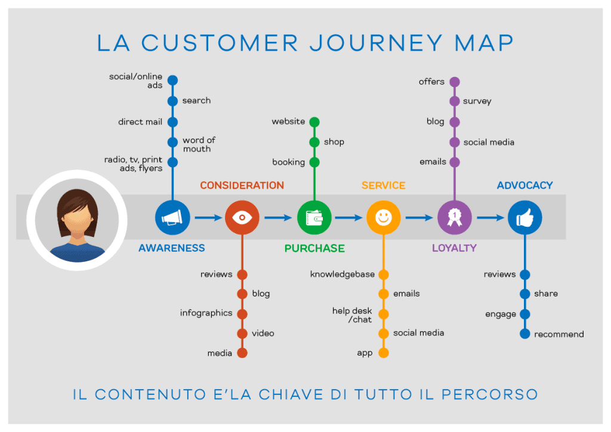

<!-- _paginate: false -->
<!-- _footer: "https://www.pexels.com/it-it/foto/imac-d-argento-sulla-parte-superiore-del-tavolo-in-legno-marrone-326502/" -->

# UX Design

---

# Genesi di questo corso

Dopo molti studi e ricerche, ho deciso di condividere le mie conoscenze e la mia passione per lo UX Design attraverso questo corso introduttivo. Ho seguito un corso specifico per approfondire le mie competenze in questo ambito e ho fatto numerosi approfondimenti per assicurarmi di avere una comprensione completa di questa disciplina in continua evoluzione.

Con questo corso, voglio offrirti una panoramica del mondo dello UX Design, delle professioni ad esso correlate e dei principali concetti che ne costituiscono il fondamento. Sarà un'opportunità unica per comprendere meglio questo affascinante campo e per scoprire le opportunità che esso offre.

---

# Argomenti del corso

Comprendere i processi dietro la UX Research può aiutarvi a creare un prodotto di successo. Per ottenere ciò, è necessario partire da un'idea e dotarla di un'ottima realizzazione e implementazione. 
Queste slide possono fornirvi una base di conoscenza, sulla quale costruirvi per diventare un esperto del settore.

---

# UX e UI

Partiamo quindi col primo argomento: la differenza fra UX e UI.

---

# UX - __User Experience__

__UX__ è una parola inglese che può essere tradotta come "esperienza utente" e si riferisce all'insieme delle sensazioni, emozioni, attitudini e opinioni che un individuo sperimenta quando utilizza un prodotto, servizio o sistema.

In ambito informatico, il termine UX viene spesso utilizzato per fare riferimento alla progettazione di interfacce utente intuitive, accattivanti e facili da usare, sia in ambito web che mobile. L'obiettivo della progettazione UX è quello di rendere l'utilizzo di un prodotto il più piacevole e soddisfacente possibile per gli utenti, al fine di aumentarne l'adozione e la fidelizzazione.

ChatGPT

---

# UI - __User Interface__

__UI__ è l'interfaccia tra un'applicazione e l'utente. Utilizza elementi visivi come bottoni, menu a tendina, interfacce grafiche, ecc. La UI consente all'utente di interagire con l'applicazione e di accedere ai suoi servizi.

---

<https://imaginxp.com/a-pilot-to-the-difference-between-ui-and-ux/>

---

# Cos'è la trasformazione digitale?

La trasformazione digitale è un processo in cui le organizzazioni usano le tecnologie digitali per modificare le loro operazioni, processi e prodotti. L'obiettivo della trasformazione digitale è migliorare l'efficienza, la produttività e la competitività, aumentando il vantaggio competitivo dell'azienda. Una trasformazione digitale ben eseguita può anche aiutare le organizzazioni a fornire un'esperienza cliente migliore, ad alimentare l'innovazione e a migliorare la redditività.

La UX è un passo fondamentale di questo percorso.

---

# Centralità della trasformazione

Molte aziende hanno messo la UX al centro del proprio processo di comunicazione:

- Apple semplificando il design degli smartphone
- Google cambiando il modo col quale fare ricerca
- Facebook creando il concetto di social media

---

# La spesa in UX rappresenta un investimento

Rendere semplice ed intuitivo un processo ne migliora l'efficacia e lo rende più produttivo

---

# Investimenti in UX

Uno studio del 2013 condotto da Forrester ha dimostrato che un miglioramento delle prestazioni di un sito web del 25% può aumentare le conversioni delle vendite del 74%.

Un altro studio del 2014 ha mostrato che il 74% degli utenti web considera la qualità dell'esperienza utente come il principale criterio di giudizio di un sito web.

Uno studio del 2015 ha scoperto che il 49% degli utenti web che hanno avuto un'esperienza negativa con un sito web sono meno propensi a comprare da quell'azienda in futuro.

Una ricerca del 2016 ha dimostrato che il 75% degli utenti giudica la credibilità di un'azienda sulla base dell'aspetto del suo sito web.

---

# Vantaggi

Questi sono solo alcuni esempi di come l'investimento in UX può avere un impatto positivo sulla performance di un'azienda. In generale, una buona UX può aumentare il tasso di conversione, ridurre il tasso di abbandono del carrello della spesa, aumentare la soddisfazione e la fedeltà degli utenti e migliorare la reputazione di un'azienda.

---

# AARRR

AARRR è un acronimo che rappresenta un modello di crescita noto anche come "Pirate Metrics". Si tratta di una sequenza di cinque fasi fondamentali che un'azienda deve percorrere per ottenere successo.

---

# AARRR - AA

Acquisizione (__Acquisition__): si tratta del primo contatto che gli utenti hanno con il prodotto o il servizio dell'azienda. In questa fase è importante individuare le fonti di traffico e le strategie di marketing più efficaci per attirare nuovi utenti.

Attivazione (__Activation__): si tratta della fase in cui gli utenti diventano attivi e iniziano a utilizzare il prodotto o il servizio. In questa fase è importante assicurare che gli utenti abbiano un'esperienza positiva e che comprendano come utilizzare il prodotto.

---

# AARRR - RRR

Retention (__Retention__): si tratta della fase in cui gli utenti continuano a utilizzare il prodotto o il servizio nel tempo. In questa fase è importante mantenere gli utenti interessati e soddisfatti, in modo da ridurre il tasso di abbandono.

Referral (__Referral__): si tratta della fase in cui gli utenti parlano del prodotto o del servizio ai loro amici e conoscenti. In questa fase è importante creare un prodotto o un servizio che sia talmente soddisfacente da spingere gli utenti a consigliarlo ad altre persone.

Revenue (__Revenue__): si tratta della fase in cui gli utenti generano entrate per l'azienda attraverso l'acquisto di prodotti o servizi o attraverso altre forme di monetizzazione. In questa fase è importante individuare le fonti di revenue più efficaci e implementare strategie per aumentare le entrate.

---

# Modello AARRR

Il modello AARRR viene spesso utilizzato in ambito startup per identificare le aree su cui l'azienda deve concentrarsi per ottenere crescita e successo a lungo termine.

---

# UX e Activation

Il primo impatto con l'azienda viene dato dalla UX di prodotto: è inutile investire in acquisizione utenti, se poi siamo carenti dal punto di vista dell'attivazione utenti

- Complessità
- Percorsi errati
- Mancanza di chiarezza

---

# Design di prodotti / servizi

Come devono essere strutturati i servizi?

## Design thinking

Approccio basato su empatia, sperimentazione e creatività

## Service design

Efficienza dei servizi in base all'esperienza utente

## UX Design

Rendere intuitivi e facili da usare i servizi

---

# Design thinking

Il design thinking è un approccio metodologico alla risoluzione dei problemi e alla creazione di nuove soluzioni basato sull'empatia verso gli utenti, la sperimentazione rapida e il pensiero creativo.

Il design thinking si basa sull'idea che sia possibile trovare soluzioni innovative ai problemi attraverso il coinvolgimento attivo degli utenti e la sperimentazione di diverse opzioni. In questo modo, il design thinking cerca di coniugare la creatività con il pensiero strategico e l'analisi dei dati.

Occorre rompere la segregazione dei dipartimenti per trovare insieme nuove soluzioni.

---

# Service design

Il service design è una disciplina che si occupa della progettazione di servizi basati sull'esperienza utente (UX). Il service design si concentra sulla creazione di servizi efficienti, coerenti e soddisfacenti per gli utenti, tenendo conto di tutti gli aspetti che influiscono sulla loro esperienza di utilizzo.

Il service design si basa sulla comprensione delle esigenze e dei desideri degli utenti e mira a creare servizi che siano facili da utilizzare, intuitivi e che rispondano alle loro aspettative. Inoltre, il service design cerca di ottimizzare le interazioni tra gli utenti e il servizio, al fine di rendere l'esperienza il più piacevole e soddisfacente possibile.

Il service design viene utilizzato in molti settori, come il turismo, il trasporto, la sanità, il retail e molti altri, al fine di progettare servizi efficaci e soddisfacenti per gli utenti.

---

# UX Design

UX design è il processo di progettazione di prodotti, servizi o sistemi che tengono conto dell'esperienza utente. L'obiettivo dello UX design è quello di creare prodotti, servizi o sistemi che siano intuitivi, facili da usare e soddisfacenti per gli utenti, al fine di aumentarne l'adozione e la fidelizzazione.

Lo UX design si basa sulla comprensione delle esigenze, dei desideri e delle abitudini degli utenti, e utilizza metodi quali la ricerca, il testing e il design thinking per creare soluzioni che soddisfino queste esigenze. Inoltre, lo UX design tiene anche conto dell'impatto emotivo che un prodotto, un servizio o un sistema ha sugli utenti, al fine di creare un'esperienza coerente e piacevole.

Lo UX design viene spesso utilizzato in ambito informatico per progettare interfacce utente intuitive e accattivanti, sia in ambito web che mobile.

---

# Metriche

Le metriche di valutazione del design sono degli strumenti che vengono utilizzati per misurare l'efficacia di un prodotto, di un servizio o di un sistema dal punto di vista dell'esperienza utente.

---

# Metriche principali - 1

__Soddisfazione utente__: si tratta di una misura della soddisfazione degli utenti rispetto al prodotto, al servizio o al sistema. La soddisfazione utente può essere misurata attraverso sondaggi o interviste a campione, o utilizzando strumenti di analisi delle prestazioni come il Net Promoter Score (NPS).

__Tasso di conversione__: si tratta di una misura del numero di utenti che completano un'azione desiderata (ad esempio, il completamento di un modulo di registrazione o l'acquisto di un prodotto) rispetto al numero totale di utenti che hanno visitato il sito.

---

# Metriche principali - 2

__Tasso di abbandono__: si tratta di una misura del numero di utenti che abbandonano il sito o l'applicazione prima di completare un'azione desiderata. Il tasso di abbandono può essere utilizzato per identificare problemi con la facilità d'uso o con la soddisfazione degli utenti.

__Tempo di permanenza__: si tratta di una misura del tempo che gli utenti trascorrono sul sito o sull'applicazione. Il tempo di permanenza può essere utilizzato per valutare l'interesse degli utenti per il contenuto o per il prodotto/servizio offerto.

__Tasso di rimbalzo__: si tratta di una misura del numero di utenti che lasciano il sito dopo aver visitato solo una pagina. Il tasso di rimbalzo può essere utilizzato per valutare l'attrattività del sito o dell'applicazione per gli utenti.

---

# UX ROI Esterno

UX ROI (acronimo di User Experience Return on Investment) si riferisce al ritorno economico ottenuto dall'investimento in UX (User Experience). Lo UX ROI può essere utilizzato per misurare il valore ottenuto da un progetto di UX o per confrontare il ritorno ottenuto da diversi progetti di UX.

Calcolare l'UX ROI può essere utile per determinare se un investimento in UX sia stato profittevole e per identificare le aree di UX su cui concentrarsi per ottenere il massimo ritorno. Tuttavia, il calcolo dell'UX ROI può essere complesso in quanto può essere difficile quantificare il valore dell'esperienza utente in termini monetari.

Per calcolare l'UX ROI, è necessario prima determinare il costo del progetto di UX e poi misurare l'impatto dell'investimento in UX sulla performance aziendale.

---

# UX ROI Interno

Miglioramento dell'efficienza interna di un'azienda

- Riduzione del tempo per effettuare un task
- Ridurre il numero degli errori di un utente col miglioramento di testi, la scelta di immagini più intuitive, la semplificazione dell'interfaccia
- Riduzione delle richieste di supporto: il supporto ha un costo che incide sui costi dell'azienda
- Riduzione del tempo legato alla formazione: più è complesso il nostro prodotto, più dovremo investire in formazione per poterlo utilizzare

---

# Analisi dei dati

Per raccogliere delle informazioni che ci aiuteranno a capire meglio come si stanno comportando gli utenti, occorrono degli strumenti. Questi strumenti ci aiuteranno a capire dove gli utenti si bloccano, su quali pagine entrano ed escono dal sito e altro ancora.

---

# Visual Analytics

Le __click head map__, le __scroll map__ e le __mouse movement heatmap__ sono tutte tecniche di visual analytics utilizzate per analizzare l'attività degli utenti su un sito web o su un'applicazione.

---

# Click heat map

Le __click heat map__ mostrano le aree del sito o dell'applicazione che vengono cliccate con maggiore frequenza dagli utenti. Le "click heat map" possono essere utilizzate per identificare le aree più popolari del sito o dell'applicazione e per valutare l'efficacia del layout delle pagine.

---

# Google heat map

<https://www.technowlogy.org/what-is-heat-map-examples.html>

---

# Scroll map

Le __scroll map__ mostrano fino a che punto gli utenti scorrono una pagina del sito o dell'applicazione. Le "scroll map" possono essere utilizzate per valutare l'interesse degli utenti per il contenuto di una pagina e per identificare eventuali problemi di usabilità che potrebbero impedire agli utenti di accedere a tutto il contenuto.

---

# Scroll map esempio

<https://www.hotjar.com/blog/scroll-maps/>

---

# Mouse movement heatmap

Le __mouse movement heatmap__ mostrano i movimenti del mouse degli utenti durante la navigazione sul sito o sull'applicazione. Le "mouse movement heatmap" possono essere utilizzate per valutare l'attenzione degli utenti su determinate aree del sito o dell'applicazione e per identificare eventuali problemi di usabilità o di interesse degli utenti.

---

# Mouse movement heatmap esempio

<https://www.mousestats.com/products/mouse-move-heatmaps>

---

# Intervista contestuale

L'intervista contestuale è una tecnica di raccolta dei dati utilizzata nell'analisi UX per comprendere meglio come gli utenti interagiscono con un prodotto, un servizio o un sistema in contesto reale.

L'intervista contestuale consiste nel condurre un'intervista con gli utenti mentre questi utilizzano il prodotto, il servizio o il sistema in questione, al fine di ottenere una comprensione più approfondita delle loro esigenze, dei loro comportamenti e delle loro sfide.

Le interviste contestuali sono particolarmente utili per identificare problemi di usabilità o di soddisfazione degli utenti che potrebbero non essere evidenti attraverso gli analytics.

---

# Impatti del ROI Esterno

- Impatto sulle vendite: aumento dei prodotti venduti
- Impatto sulla fidelizzazione: dopo il primo acquisto gli utenti tornano nuovamente sul servizio
- Acquisizione di nuovi lead: gli utenti arrivano sul sito ed effettuano dei task
- Soddisfazione dei clienti

---

# Metriche - Conversion rate

Il conversion rate (tasso di conversione) è una metrica utilizzata per misurare il numero di utenti che completano un'azione desiderata (ad esempio, il completamento di un modulo di registrazione o l'acquisto di un prodotto) rispetto al numero totale di utenti che hanno visitato il sito.

Il conversion rate viene spesso utilizzato in ambito e-commerce per misurare l'efficacia del sito nel trasformare i visitatori in clienti, ma può essere utilizzato anche in altri ambiti per misurare il successo di una campagna o di un'iniziativa.

Per calcolare il conversion rate, si divide il numero di azioni completate dal numero totale di visitatori e si moltiplica per 100 per ottenere una percentuale. Ad esempio, se un sito ha ricevuto 1000 visitatori e 100 di questi hanno completato un acquisto, il conversion rate sarà del 10%.

---

# Altre metriche

- Prezzo medio di checkout

Il valore medio dei prodotti inseriti nel carrello del sito

- CLV

Il CLV (acronimo di Customer Lifetime Value) è una metrica che indica il valore totale che un cliente porterà all'azienda durante il suo ciclo di vita con essa. Normalmente valutato nei 3 anni.

- Traffico organico

Il traffico organico è il traffico che proviene da fonti di ricerca naturali come i motori di ricerca, i social media, i link esterni e i contenuti di referral. Si tratta di una delle principali fonti di traffico per una maggior parte dei siti web.

---

# Progettazione della UX

A grandi linee la progettazione di un servizio può essere divisa in 4 fasi:

1 Ricerca delle esigenze dei propri utenti
2 Creazione di un prototipo del servizio
3 Test su utenti reali
4 Raccolta esigenze e reiterazione sul punto 2

---

# Best Practice - 1

Partire dalle esigenze degli utenti: è importante comprendere le esigenze, i comportamenti e le sfide degli utenti per progettare un'esperienza utente efficace e soddisfacente.

Raggiungere un equilibrio tra utilità, usabilità e piacevolezza: è importante che un prodotto, un servizio o un sistema sia utile, facile da usare e piacevole per gli utenti.

Favorire l'accessibilità: è importante che un prodotto, un servizio o un sistema sia accessibile a tutti, indipendentemente dalle abilità o dalle limitazioni degli utenti.

Sviluppare una solida architettura dell'informazione: è importante organizzare le informazioni in modo logico e coerente per facilitarne la comprensione e l'utilizzo da parte degli utenti.

---

# Best Practice - 2

Testare con gli utenti: è importante testare il prodotto, il servizio o il sistema con gli utenti per identificare eventuali problemi e apportare miglioramenti.

Fare un uso appropriato delle animazioni e dei suoni: le animazioni e i suoni possono essere utili per attirare l'attenzione degli utenti o per fornire feedback, ma è importante utilizzarli in modo appropriato e non eccessivo.

Mantenere un design coerente: è importante mantenere un design coerente all'interno di un prodotto, un servizio o un sistema per facilitarne l'utilizzo e la comprensione da parte degli utenti.

---

# Alcune scuse per non lavorare sulla UX

- Mancanza di tempo: non ho tempo, il prodotto deve uscire entro una certa data.
- Mancanza di soldi: non ho un budget per la ricerca
- Non dobbiamo fare dei test perché conosciamo già i problemi
- Non servono degli utenti reali per i test, bastiamo noi
- Conosciamo i nostri utenti e sappiamo già cosa vogliono
- Se ne occupa già chi inserisce i contenuti

---

# YOU != USER

by Jacob Nielsen

Le tue esigenze sono diverse da quelli dei tuoi clienti

---

# Jacob Nielsen

Jacob Nielsen è uno dei più noti esperti di usabilità e di design dell'interazione al mondo.

Nielsen è conosciuto per i suoi contributi alla comprensione dell'usabilità e dell'esperienza utente, in particolare per le sue ricerche sulla lettura sullo schermo e sulle attività di ricerca sui motori di ricerca. Ha anche sviluppato il concetto di "desiderabilità", ovvero l'importanza di progettare prodotti, servizi e sistemi che siano non solo funzionali e facili da usare, ma anche piacevoli e soddisfacenti per gli utenti.

Nielsen è autore di numerosi libri e articoli sull'usabilità e sull'esperienza utente, ed è fondatore e principal analyst della Nielsen Norman Group, una società di consulenza che fornisce servizi di usabilità e di design dell'interazione.

[Jakob Nielsen](https://en.wikipedia.org/wiki/Jakob_Nielsen_(usability_consultant))

---

# Come pensiamo?

Se non mettiamo l'utente al centro della UX rischiamo di fare qualcosa che serve solo a noi

<https://blog.prototypr.io/ui-guidelines-and-why-you-should-care-62d4d0da1595>

---

# Cosa vede il cliente e cosa vede l'utente

<https://twitter.com/adsofbrands/status/1264540221036691468?lang=ga>

---

# Quali lavori puoi fare in ambito UX Design?

UX Design è un campo molto ampio che può comprendere diversi ruoli. Alcuni dei lavori più comuni in questo campo sono:

__Interaction Design__: progettazione di interfacce utente e loro interazioni
__Usabilità__: valutazione dell'usabilità di un prodotto o di un'esperienza utente
__Copywriting__: scrittura di contenuti per un prodotto o un'esperienza utente
__Interfaccia grafica__: progettazione dell'aspetto visivo di un prodotto o di un'esperienza utente
__Design dei contenuti__: progettazione di contenuti per un prodotto o un'esperienza utente
__Prototipazione__: costruzione di prototipi per simulare un prodotto o un'esperienza utente
__Accessibilità__: progettazione di prodotti e servizi accessibili a tutti gli utenti

---

# UX Research

---

# Cos'è la UX Research?

La UX Research è una disciplina che esplora le esperienze degli utenti per comprendere come i prodotti, i servizi e le interfacce digitali possono soddisfare le loro necessità. Utilizza una serie di metodi e tecniche, come interviste, sondaggi, test di usabilità, per raccogliere informazioni su come gli utenti percepiscono, usano e sentono in relazione ai prodotti. Queste informazioni vengono quindi utilizzate per progettare soluzioni migliori per gli utenti.

---

# --- FINE REVISIONE ---

---

# Passi di una UX Research

## Test

- Incontro con gli utenti in una situazione di test

Focalizzazione su prodotto e servizio: uso di interfacce dinamiche o statiche, analisi dell'uso del prodotto, prime impressioni.
Analisi del contesto: utilizzo al lavoro, da casa, in mobilità, in una certa zona geografica.
Analisi sulla persona: interviste, gruppi di interesse.

---

# I dati

- Analisi dei test fatti con gli utenti, utilizzando solo i dati prodotti

Possiamo raccogliere dati sia visivamente che tramite software. In entrambi i casi la raccolta dei dati è importante per poter capire cosa succede all'interno del servizio.

---

# Rilevazioni

- Rilevazione dei comportamenti degli utenti mentre usano il sistema

Al di fuori dei test pilotati, è anche importante raccogliere dei dati in situazioni nelle quali gli utenti si considerano liberi di usare il prodotto, senza la direttiva da parte di un intervistatore.

---

# Alcuni test utilizzabili in UX Research

- Tree test
- Card sorting
- First Click
- Eye tracking study

---

# Tree test

Il tree test è una tecnica di test dell'usabilità che viene utilizzata per valutare la struttura di navigazione di un sito web o di un'applicazione. Il tree test consiste nel presentare agli utenti un elenco di opzioni di navigazione (ad esempio, le voci del menu principale di un sito web) e chiedere loro di individuare la voce di menu che ritengono più adeguata per accedere a una determinata sezione del sito.

Il tree test è utile per verificare se la struttura di navigazione di un sito è intuitiva e facile da usare per gli utenti. A partire dai risultati del test, gli UX designer possono individuare eventuali problemi di usabilità e apportare miglioramenti alla struttura di navigazione del sito.

Il tree test può essere condotto online o di persona, utilizzando un software di test o una semplice lista di opzioni di navigazione. È importante che il tree test venga effettuato su un campione rappresentativo di utenti per ottenere risultati significativi.

---

# Card sorting

Il card sorting è una tecnica di progettazione dell'interazione che viene utilizzata per aiutare gli UX designer a comprendere come gli utenti organizzano e categorizzano le informazioni. Consiste nel presentare agli utenti un insieme di carte con delle informazioni su di esse (ad esempio, titoli di articoli o voci di menu) e chiedere loro di raggruppare le carte in modo coerente e di dare un titolo a ogni gruppo.

Il card sorting può essere condotto online o di persona, utilizzando un software apposito o semplicemente delle carte fisiche. È una tecnica utile per aiutare gli UX designer a comprendere come gli utenti pensano e organizzano le informazioni, e può essere utilizzata per progettare la struttura di navigazione di un sito web o di un'applicazione.

Il card sorting è particolarmente utile quando si devono progettare categorie per un sito o per un'applicazione e si vuole capire come gli utenti le utilizzerebbero. È importante che il card sorting venga effettuato su un campione rappresentativo di utenti per ottenere risultati significativi.

---

# First Click

Il first click test (o primo clic test) è una tecnica di test dell'usabilità che viene utilizzata per valutare l'efficacia della navigazione di un sito web o di un'applicazione. Consiste nel presentare agli utenti una serie di link o di voci di menu e chiedere loro di cliccare sulla voce di menu che ritengono più adeguata per accedere a una determinata sezione del sito.

Il first click test è utile per verificare se la navigazione di un sito è intuitiva e facile da usare per gli utenti. A partire dai risultati del test, gli UX designer possono individuare eventuali problemi di usabilità e apportare miglioramenti alla navigazione del sito.

Il first click test può essere condotto online o di persona, utilizzando un software di test o una semplice lista di opzioni di navigazione. È importante che il first click test venga effettuato su un campione rappresentativo di utenti per ottenere risultati significativi.

---

# Eye tracking study

L'eye tracking study (o studio di tracciamento oculare) è una tecnica di test dell'usabilità che viene utilizzata per valutare l'attenzione e il comportamento visivo degli utenti durante l'utilizzo di un prodotto, di un servizio o di un sistema.

Consiste nel utilizzare uno strumento di tracciamento oculare, che può essere un apparecchio o un software, per registrare i movimenti degli occhi degli utenti mentre svolgono una determinata attività (ad esempio, la navigazione di un sito web o l'utilizzo di un'applicazione).

L'eye tracking study è utile per capire come gli utenti percepiscono e interagiscono con un prodotto o un servizio, e può essere utilizzato per individuare eventuali problemi di usabilità o per ottimizzare l'esperienza utente. L'eye tracking study può essere condotto sia di persona che online, ed è particolarmente utile per valutare l'impatto di elementi visivi come la posizione, il colore o il design di un prodotto o di un servizio.

---

# Test interattivo

Assegnazione di un compito da eseguire. Ad esempio per un e-commerce potrebbe essere:

- Registrati al sito
- Metti in carrello un prodotto
- Acquista un prodotto

---

# Cosa vogliamo studiare?

Focalizzazione sull'obiettivo dello studio di UX

- Prima volta che viene utilizzato il prodotto o il servizio
- Utilizzo regolare del prodotto o del servizio
- Versione preliminare del prodotto o del servizio
- Versione finale del prodotto o del servizio pronta per essere messa in produzione
- Aggiunta di una nuova sezione al prodotto o al servizio
- Possibili alternative a una modifica di una parte del prodotto o del servizio

---

# Perché facciamo ricerca?

- Ottenere nuove idee
- Analizzare diverse opzioni
- Comprendere come gli utenti utilizzano il prodotto o il servizio
- Capire le ragioni dei comportamenti degli utenti

---

# Quando fare o non fare UX Reserch

Per valutare se è conveniente fare o meno una determinata attività, è importante considerare sia il tempo che verrà impiegato sia i costi che questa comporterà.

---

# Prima e dopo

<https://uxdesign.cc/driving-business-with-user-experience-d7f934a41b29>

---

# Analisi dei dati che potrei avere in casa

Alcune domande che potrei farmi per iniziare ad avere dei dati sui quali poter fare una prima analisi

- Il prodotto ha installato un sistema di analytics che posso consultare?

- Ho un customer care che raccoglie le esigenze dei clienti?

- Ho già una ricerca fatta nel passato che posso integrare?

---

# Condivisione dei dati

- I dati sono accessibili?

- I dati sono condivisi?

- I dati sono analizzati?

- I dati sono stati confrontati o aggregati?

---

# Riduzione costi di progetto

La ricerca potrebbe declassare o rimuovere una funzionalità di prodotto.

- Evitiamo una funzionalità che non serve
- Evitiamo di introdurre qualcosa che non è richiesta
- Non introduciamo un'esigenza che non ha il mercato

---

# Compromessi con la UX research

- Sono disposto a rinunciare una funzionalità?
- Sono disposto a spostare le date di rilascio?
- Posso modificare un servizio in base ai risultati della ricerca?

---

# Cambio di prodotto

<https://greentomato.academy/ux-ui-design-methodology-webinar/>

---

# Aumento dei ricavi

Come la UX Research può aiutarci?

- Nuovi prodotti e servizi
- Miglioramento dei tassi di conversione dei prodotti esistenti
- Aumento della fedeltà (loyalty), della frequenza d'uso e promozione (advocacy) di un prodotto o servizio

---

# Quanti utenti ci servono per fare UX Research?

Il numero di utenti che serve per fare una UX Research dipende dal tipo di studi che si vogliono effettuare e dalle informazioni che si vogliono raccogliere. In generale, per ottenere risultati significativi è importante che la UX Research venga effettuata su un campione rappresentativo di utenti.

Per determinare il numero di utenti da coinvolgere in una UX Research, è importante considerare diversi fattori, come il tipo di prodotto o servizio che si sta valutando, il tipo di utenti che lo utilizzano, il tipo di test che si vuole effettuare e il livello di accuratezza richiesto.

In genere, per ottenere risultati accurati e rappresentativi, è consigliabile coinvolgere almeno 10-15 utenti per ogni tipo di test. Tuttavia, il numero di utenti può variare a seconda delle esigenze specifiche dello studio. Ad esempio, se si vuole valutare un prodotto o un servizio destinato a un pubblico ampio e eterogeneo, potrebbe essere necessario coinvolgere un numero maggiore di utenti per ottenere risultati significativi.

---

# Utenti necessari a scoprire problemi di usabilità

Source: Jakob Nielsen's chart fro m his March 19 th , 2000 Alertbox Column.

---

# Decidono gli utenti?

__Le persone non vogliono macchine, ma cavalli più veloci__ Questo aneddoto è spesso attribuito a Henry Ford, il fondatore della Ford Motor Company. Secondo la leggenda, quando Ford iniziò a produrre le sue prime automobili, molti potenziali acquirenti erano scettici e non vedevano l'utilità di questo nuovo tipo di trasporto. Per convincere i clienti dei vantaggi dell'automobile rispetto al cavallo, Ford avrebbe detto che la gente non voleva veramente una macchina, ma semplicemente un cavallo più veloce.

Questo aneddoto viene spesso citato per illustrare l'importanza di comprendere le esigenze e i desideri dei clienti e di progettare prodotti o servizi che rispondano a queste esigenze. Tuttavia, non ci sono prove storiche che confermano che Henry Ford abbia effettivamente fatto questa dichiarazione.

---

# Gli utenti sanno cosa vogliono?

Bisogna tener presente che gli utenti spesso non sono in grado di esprimere chiaramente le loro esigenze e i loro desideri, e che le loro richieste non sempre corrispondono a ciò di cui hanno veramente bisogno. Pertanto, è fondamentale che gli sviluppatori e i progettisti utilizzino metodi di indagine e di valutazione dell'usabilità per comprendere in modo approfondito le esigenze degli utenti e progettare soluzioni che rispondano a queste esigenze in modo efficace.

---

# Gli utenti rappresentano in modo corretto i loro comportamenti?

L'utente ha una visione chiara delle proprie azioni che potrebbe essere diversa dalla realtà? Probabilmente si: ci potrebbero essere sia dei bias cognitivi che la volontà di azzerare o aumentare i problemi riscontrati sui prodotti. Unire quanto dichiarato dagli utenti ai dati ci permette di avere una visione migliore dei prodotti.

---

# Serve una strategia di prodotto

Gli utenti ci aiutano a migliorare e adattare la strategia dei prodotti, ma non dovrebbero determinare la visione d'insieme che prende in considerazione altri fattori legati al business, al profitto e alle priorità di sviluppo dei prodotti e servizi.

---

# I prototipi

In ambito UX Design, un prototipo è una rappresentazione preliminare di un prodotto, di un servizio o di un sistema, che viene utilizzata per testare e valutare l'usabilità e l'efficacia di una soluzione progettuale. I prototipi possono assumere diverse forme, a seconda delle esigenze specifiche dello studio e del livello di dettaglio desiderato. Ad esempio, i prototipi possono essere realizzati con strumenti di disegno o di modellazione 3D, o possono essere semplici schizzi o mockup realizzati su carta.

I prototipi sono uno strumento molto utile in ambito UX Design perché consentono di testare e valutare le soluzioni progettuali in modo rapido e a basso costo, prima di investire tempo e risorse nello sviluppo di un prodotto o di un servizio finito. I prototipi possono essere utilizzati per raccogliere feedback dagli utenti e per individuare eventuali problemi o difficoltà nell'utilizzo del prodotto o del servizio, al fine di apportare modifiche e miglioramenti prima della realizzazione definitiva.

---

# Come posso realizzare dei prototipi

Ci sono molti strumenti che è possibile utilizzare per creare prototipi:

Strumenti di disegno e modellazione 3D, come Adobe Illustrator, Adobe Photoshop o Autodesk Fusion 360. Questi strumenti consentono di creare prototipi dettagliati e realistici, con un alto livello di fedeltà visiva.

Strumenti di prototipazione rapida, come InVision o Marvel. Questi strumenti consentono di creare prototipi interattivi partendo da immagini statiche o da schizzi, senza la necessità di conoscenze avanzate di design o di programmazione.

Strumenti di prototipazione low-fi, come carta e penna o adesivi Post-it. Questi strumenti sono molto rapidi e facili da utilizzare, e consentono di creare prototipi rudimentali ma efficaci per raccogliere feedback iniziali dagli utenti.

---

# Quale strumento scegliere?

Dipende dalle esigenze specifiche dello studio e dal livello di dettaglio e interattività desiderato. È importante scegliere lo strumento più adeguato per testare e valutare le soluzioni progettuali in modo efficace e rapido.

[Optimal Workshop](https://www.optimalworkshop.com/)
[Figma](https://www.figma.com/)

---

# Demo

Test di utilizzo di [Draw.io](https://app.diagrams.net)
Repository GitHub [Sorgenti di Draw.it](https://github.com/jgraph/drawio)

---

# Metafora dell'altalena

<https://marcozordan.it/2018/08/quello-di-cui-il-cliente-aveva-realmente-bisogno/>

---

# Approfondimenti

Donald Norman (25/12/1935) è uno psicologo della cognizione e un esperto di design dell'interazione uomo-computer. È noto soprattutto per il suo lavoro nel campo dell'usabilità e dell'esperienza utente (UX), e per aver coniato il termine User Experience Design, UX Design.

Norman è autore di numerosi libri e articoli sull'usabilità e sull'UX, tra cui il best seller "The Design of Everyday Things" (Il design delle cose quotidiane: in italiano "La caffettiera del masochista"), che ha contribuito a diffondere la consapevolezza dell'importanza dell'usabilità e dell'esperienza utente nella progettazione di prodotti e servizi.

[Don Norman](https://en.wikipedia.org/wiki/Don_Norman)

---

# Analisi esperta

---

# Analisi esperta

L'analisi esperta (Expert Analysis) è un metodo di indagine dell'usabilità che si basa sulla valutazione del prodotto o del servizio da parte di esperti del design o dell'usabilità. L'analisi esperta consiste nell'osservare e nell'interagire con il prodotto o il servizio, al fine di individuare eventuali problemi o difficoltà nell'utilizzo e di formulare raccomandazioni per migliorare l'usabilità.

L'analisi esperta può essere utilizzata come uno strumento di indagine complementare ad altri metodi, come l'analisi dei dati o l'intervista agli utenti. Tuttavia, è importante tener presente che gli esperti hanno una conoscenza approfondita delle tecniche di progettazione e di valutazione dell'usabilità, e possono quindi avere una prospettiva diversa rispetto agli utenti non esperti. Pertanto, è importante tener conto anche delle osservazioni e dei feedback degli utenti effettivi per ottenere una valutazione dell'usabilità più completa e accurata.

---

# Perché usare l'analisi esperta? - 1

Velocità: l'analisi esperta è generalmente più rapida di altri metodi di indagine

Profondità: gli esperti hanno una conoscenza approfondita delle tecniche di progettazione e di valutazione dell'usabilità, e sono quindi in grado di individuare problemi e suggerire soluzioni a livello di dettaglio maggiore rispetto agli utenti non esperti.

Generalizzabilità: i risultati dell'analisi esperta possono essere generalizzati a una popolazione più ampia di utenti, poiché gli esperti sono in grado di individuare problemi che potrebbero non essere evidenti per gli utenti non esperti.

Complementarità: l'analisi esperta può essere utilizzata come uno strumento di indagine complementare ad altri metodi

---

# Perché usare l'analisi esperta? - 2

Risparmio di tempo e di costi: l'analisi esperta può consentire di risparmiare tempo e costi rispetto ad altri metodi di indagine, poiché richiede meno tempo per l'esecuzione.

Valutazione tempestiva: l'analisi esperta può essere effettuata in tempi più rapidi rispetto ad altri metodi di indagine.

Valutazione di nuove tecnologie: l'analisi esperta può essere utilizzata per valutare l'usabilità di nuove tecnologie o di soluzioni innovative.

Valutazione di prodotti o servizi complessi: l'analisi esperta è particolarmente adatta per la valutazione di prodotti o servizi complessi, che richiedono una conoscenza approfondita delle tecniche di progettazione e di valutazione dell'usabilità per essere compresi e valutati in modo accurato.

---

# Perché non usare l'analisi esperta?

Dipendenza dall'esperienza degli esperti: i risultati dell'analisi esperta dipendono dall'esperienza e dalla competenza degli esperti valutatori.

Bias degli esperti: gli esperti possono avere un bias inconscio nella valutazione del prodotto o del servizio.

Limitata rappresentatività: l'analisi esperta non rappresenta necessariamente la percezione e l'esperienza degli utenti effettivi del prodotto o del servizio.

Costi: l'analisi esperta può essere più costosa di altri metodi di indagine, poiché richiede l'impiego di esperti specializzati e il loro tempo è generalmente più prezioso rispetto a quello degli utenti non esperti.

Limitata scalabilità: l'analisi esperta è generalmente meno scalabile rispetto ad altri metodi di indagine, poiché richiede una valutazione manuale.

---

# Approcci

Analisi euristica: valutazione di un prodotto o servizio in base a un insieme predefinito di principi di usabilità (gli euristici).

Analisi di design: valutazione in base a criteri di design, come l'aderenza alle linee guida di progettazione, la coerenza dell'interfaccia utente, la leggibilità del testo e altri aspetti di natura estetica e funzionale.

Analisi di task: valutazione in base alla capacità di supportare l'utente nell'esecuzione di un insieme specifico di compiti.

Analisi della user experience: valutazione in base all'impatto complessivo che ha sull'esperienza utente, considerando sia aspetti funzionali che emotivi.

Analisi cognitiva: valutazione in base all'impatto che ha sulla mente dell'utente, considerando i processi mentali coinvolti nell'utilizzo e le eventuali difficoltà.

---

# Cosa sono gli euristici?

Gli euristici sono i principi di usabilità che rappresentano le "regole d'oro" della progettazione dell'interfaccia utente. Gli euristici sono utilizzati nell'analisi euristica, uno degli approcci all'analisi esperta (Expert Analysis), per valutare la qualità dell'usabilità di un prodotto o di un servizio.

Gli euristici sono stati formulati da Jakob Nielsen e da Don Norman, e consistono in un insieme di 10 principi che devono essere seguiti per progettare interfacce utente efficaci e facili da usare

---

- Visibilità dello stato del sistema: il sistema deve mantenere l'utente informato su ciò che sta accadendo, fornendo feedback tempestivo sull'esecuzione delle azioni dell'utente.

- Corrispondenza tra sistema e mondo reale: il sistema deve parlare la stessa lingua degli utenti, utilizzando termini e concetti familiari e coerenti con le aspettative degli utenti.

- Prevedibilità dell'azione dell'utente: le azioni dell'utente devono avere effetti prevedibili, in modo che l'utente sappia cosa aspettarsi in seguito a una determinata azione.

- Reversibilità delle azioni: l'utente deve avere la possibilità di annullare o correggere le azioni che ha appena eseguito, senza conseguenze indesiderate.

---

- Semplicità di utilizzo: il sistema deve essere semplice e facile da usare, evitando di richiedere all'utente conoscenze specialistiche o azioni complicate.

- Aiuti visivi: il sistema deve fornire visualizzazioni di dati e di opzioni appropriate, che aiutino l'utente a comprendere meglio le informazioni e a prendere decisioni.

- Consistenza: il sistema deve essere coerente nel modo in cui presenta le informazioni e gestisce le azioni dell'utente, in modo da evitare confusione e ambiguità.

- Prevenzione degli errori: il sistema deve prevedere e prevenire gli errori che l'utente potrebbe commettere, offrendo opzioni di recupero e di ripristino in caso di problemi.

---

- Riconoscimento piuttosto che ricordo: il sistema deve supportare la capacità di riconoscimento dell'utente piuttosto che la sua memoria, fornendo informazioni e opzioni in modo visivo e facilmente accessibile.

- Aiuto e documentazione: il sistema deve fornire una documentazione e un supporto adeguati per aiutare l'utente a comprendere il funzionamento del prodotto o del servizio e a risolvere eventuali problemi.

---

# Obiettivi di un'analisi esperta - 1

Gli obiettivi dell'analisi esperta (Expert Analysis) possono variare a seconda dell'approccio utilizzato e del contesto in cui viene effettuata. In generale, però, gli obiettivi dell'analisi esperta possono essere i seguenti:

Valutare la qualità dell'usabilità di un prodotto o di un servizio: l'analisi esperta può essere utilizzata per verificare se un prodotto o un servizio soddisfa i criteri di usabilità stabiliti e se è facile e intuitivo da usare per gli utenti.

Identificare i problemi di usabilità e le opportunità di miglioramento: l'analisi esperta può aiutare a individuare le problematiche di usabilità che impediscono all'utente di utilizzare il prodotto o il servizio in modo efficace e a individuare opportunità per migliorare l'usabilità.

---

# Obiettivi di un'analisi esperta - 2

Fornire raccomandazioni per il miglioramento dell'usabilità: l'analisi esperta può fornire suggerimenti concreti e supportare la progettazione di soluzioni per migliorare l'usabilità di un prodotto o di un servizio.

Valutare l'impatto dell'usabilità sulla user experience: l'analisi esperta può essere utilizzata per valutare come l'usabilità di un prodotto o di un servizio influisce sull'esperienza complessiva degli utenti, considerando sia aspetti funzionali che emotivi.

Supportare la prendere decisioni informate in merito alla progettazione dell'interfaccia utente: l'analisi esperta può fornire una base di conoscenze e di dati per supportare la progettazione di interfacce utente efficaci e facili da usare.

---

# Come vengono sintetizzati le divergenze rispetto alle euristiche

- Descrizione della criticità
- Quale euristica non viene rispettata?
- Qual è la gravità del problema?
- Cosa dovrebbe essere fatto per risolverlo?
- Qual è la priorità di questo problema rispetto ad altri?

---

# Interaction design

---

# Cos'è l'interaction design?

L'interaction design (IxD) è una disciplina che si occupa della progettazione delle interazioni tra gli esseri umani e i sistemi tecnologici, al fine di migliorare l'efficienza, l'efficacia e la soddisfazione degli utenti.

L'interaction design è una branca della progettazione dell'interfaccia utente (User Interface Design, UID) e si basa sulla comprensione delle esigenze, dei comportamenti e delle aspettative degli utenti, nonché sulla conoscenza degli obiettivi del sistema e del contesto d'uso.

L'interaction design comprende la progettazione di elementi visivi, di navigazione e di feedback, nonché la definizione di modelli di interazione e di flussi di lavoro. L'IxD si occupa anche della definizione di standard e di linee guida per la progettazione delle interfacce utente, al fine di garantire coerenza e facilità d'uso.

---

# Cosa dovrebbe fare l'interaction design?

Semplificare le iterazioni

---

Fonte: presentazione Apple di iPhone

---

Fonte: presentazione Apple di iPhone

---

# I principi dell'interaction design

---

# Il principio di Paul Fitts

Il principio di Paul Fitts è una legge di progettazione dell'interfaccia utente (UID) che descrive il tempo che impiega un utente per raggiungere un obiettivo sullo schermo con il puntatore del mouse.

Il principio di Fitts afferma che il tempo necessario per raggiungere un obiettivo è inversamente proporzionale alla distanza dell'obiettivo e direttamente proporzionale alla sua dimensione. In altre parole, più l'obiettivo è grande e vicino, meno tempo ci vorrà per raggiungerlo.

Il principio di Fitts viene spesso utilizzato in progettazione dell'interfaccia utente per determinare la posizione e la dimensione ottimali degli elementi interattivi sullo schermo, al fine di rendere più efficiente e facile l'interazione dell'utente con il sistema.

---

# Il principio di Hick-Hyman

Il principio di Hick-Hyman è una legge di progettazione dell'interfaccia utente (UID) che descrive il tempo che impiega un utente per scegliere tra diverse opzioni o per eseguire un compito.

Il principio di Hick-Hyman afferma che il tempo necessario per effettuare una scelta o per eseguire un compito è direttamente proporzionale al logaritmo del numero di opzioni o di passi necessari. In altre parole, più ci sono opzioni o passi da considerare, più tempo ci vorrà per prendere una decisione o per completare il compito.

Il principio di Hick-Hyman viene spesso utilizzato in progettazione dell'interfaccia utente per limitare il numero di opzioni presentate all'utente in una volta, al fine di rendere più efficiente e facile l'interazione con il sistema.

---

# Il principio di Larry Tesler

Il principio di Larry Tesler è una regola di progettazione dell'interfaccia utente (UID) che sostiene che le funzionalità di un sistema dovrebbero essere separate dalle modalità di interazione con esse.

Il principio di Tesler afferma che le funzionalità di un sistema, cioè ciò che il sistema fa, dovrebbero essere separate dalle modalità di interazione, cioè come l'utente interagisce con il sistema per ottenere quelle funzionalità. In questo modo, l'utente può scegliere la modalità di interazione più adeguata alle proprie preferenze e abilità, senza essere influenzato dalle opzioni di funzionalità: ex autocomplete.

Il principio di Tesler viene spesso utilizzato in progettazione dell'interfaccia utente per creare sistemi flessibili e personalizzabili, che possono essere adattati alle diverse esigenze e abilità degli utenti.

---

# Il principio di George Miller

Il principio di George Miller è una legge di progettazione dell'interfaccia utente (UID) che descrive la quantità di informazioni che un utente può mantenere attive nella propria mente in un dato momento.

Il principio di Miller afferma che la quantità di informazioni che un utente può mantenere attive nella mente è circa 7±2, cioè compresa tra 5 e 9 elementi. Questo significa che, per ottenere una buona comprensione e memoria delle informazioni, è importante presentare all'utente solo un numero limitato di elementi alla volta, evitando di sovraccaricarlo con troppe informazioni.

Il principio di Miller viene spesso utilizzato in progettazione dell'interfaccia utente per determinare la quantità ottimale di informazioni da presentare all'utente in una volta, al fine di rendere più facile e efficiente l'interazione con il sistema.

---

# Il principio di Poka Yoke

Il principio di Poka Yoke è una filosofia di progettazione dell'interfaccia utente (UID) che mira a prevenire gli errori o a rendere gli errori immediatamente evidenti.

Il principio di Poka Yoke, che in giapponese significa "evitare gli errori" o "impedire gli errori", sostiene che gli errori sono inevitabili e che pertanto è importante progettare sistemi che rendano gli errori visibili o che li impediscano completamente.

Il principio di Poka Yoke viene spesso utilizzato in progettazione dell'interfaccia utente per prevenire errori comuni, come ad esempio l'inserimento di dati errati, e per rendere immediatamente evidenti gli errori che si verificano, al fine di facilitare la correzione e di evitare conseguenze negative.

---

# DA QUI MODIFICARE E SEMPLIFICARE

---

# Cosa si ottiene con l'interaction design

- Creazione di modelli su carta e/o in digitale
- Realizzazione di storyboard
- Creazione di mood board

Occorre creare molto materiale per far emergere delle idee da raffinare

---

# Analisi dei processi

- Analisi dei singoli task che gli utenti devono completare
- Analisi dei casi d'uso
- Diagrammi di flusso delle informazioni

---

# Disegno dei flussi

Esempio di progettazione APP con Adalo

---

# Realizzazione prototipi

I prototipi vengono utilizzati con degli utenti per verificare la modalità di utilizzo del prodotto

---

# Il service design

---

# Cos'è il service design?

Il service design è una disciplina che si occupa della progettazione di servizi. Si tratta di un approccio basato sulla progettazione di esperienze che mira a creare servizi di alta qualità e a misura di utente.

Il service design utilizza metodologie di design thinking e tecniche di co-creazione per analizzare le esigenze degli utenti e progettare servizi che rispondano a queste esigenze in modo efficace ed efficiente. Si basa sulla comprensione dei comportamenti, delle aspettative e delle necessità degli utenti per creare servizi che siano facili da usare, accessibili e soddisfacenti.

Il service design viene spesso utilizzato nell'ambito della progettazione di servizi pubblici, come ad esempio servizi sanitari, trasporti e servizi di welfare, ma anche nell'ambito dei servizi privati, come ad esempio servizi di e-commerce o servizi di assistenza clienti.

---

<https://medium.com/@christinabruun/service-design-methodology-78e41eca4ba9>

---

# Discipline del design

<https://www.researchgate.net/figure/The-Disciplines-of-User-Experience-Adapted-from-Saffer-D-2008_fig1_282673247>

---

# Tipologie di servizi

Diretti
Indiretti
Multicanale
Condivisi
Complessi

---

# Passaggio dal prodotto al servizio

Non ti serve la caldaia, ti serve l'acqua calda

---

# Prodotto o servizio?

---

# Palcoscenico, retroscena e dietro le quinte

<https://blog.practicalservicedesign.com/the-difference-between-a-journey-map-and-a-service-blueprint-31a6e24c4a6c>

---

# E il cliente?

Capire i bisogni, i comportamenti e le esperienze dei nostri clienti ci aiuta a creare servizi migliori, che sappiano colpire nel segno a livello emotivo. Conoscere le attività che i nostri clienti svolgono durante le loro giornate e le aziende con cui interagiscono ci permette di offrire soluzioni più mirate e di maggiore impatto.

---

# Concetti del service design

Customer journey: il percorso che il cliente compie durante il suo utilizzo del servizio, dal primo contatto fino alla fine dell'esperienza.

Touchpoint: i punti di contatto tra il cliente e il servizio, come ad esempio il sito web, il call center, il punto vendita, etc.

Value proposition: il valore offerto dal servizio al cliente, che deve essere distintivo e rispondere alle esigenze e alle aspettative del cliente.

---

# Sfide progettuali

1 - Sfruttare l'opportunità di usare nuove piattaforme
2 - Estendere un prodotto con l'offerta di nuovi servizi
3 - Ripensare i servizi in ottica multicanale
4 - Co-creazione e innovazione sociale

---

# Piattaforme

- Value proposition sulla base d i bisogni e modelli mentali dei consumatori
- Individuare attore e servizio con i quali il nuovo servizio può dialogare
- Progettare una nuova esperienza piacevole e distintiva
- Fornire il servizio in maniera efficiente e sostenibile nel tempo

---

# Dalla logica di prodotto a quella di servizio

- Individuare nuove opportunità
- Visione olistica con il coinvolgimento di tutti i touchpoint
    La visione olistica è un modo di pensare e di guardare le cose in modo integrato e globale, tenendo conto di tutti gli aspetti e le interconnessioni che le caratterizzano. Si tratta di una prospettiva che considera l'oggetto o il fenomeno in esame come parte di un tutto più ampio e che si sforza di comprendere come tutti gli elementi coinvolti interagiscono tra loro. La visione olistica si contrappone a quella riduttiva, che tende invece a studiare le cose in modo settoriale e frammentario.
- Supervisionare lo sviluppo e la gestione di tutti i touchpoint

---

# Trasformazione in ottica multicanale

Occorre pensare al servizio in chiave digitale in modo da poterlo proporre su più canali.

---

# Co-creazione

Il service designer deve

- progettare dei momenti di dialogo fra gli attori coinvolti nel progetto
- concretizzare gli spunti raccolto in una visione di progetto
- identificare una strategia per garantire il funzionamento a lungo termine

---

# 1 - Capire gli utenti

- Capire chi coinvolgere nei momenti di dialogo
- Analisi dei dati di servizio esistenti
- Analizzare la letteratura sul tema
- Analizzare aspetti meno conosciuti dell'utente o del suo modo di interagire

Ricerca

- Esplorativa: cosa devo fare
- Generativa: prime demo
- Valutativa: valutazione del servizio per modificarlo o lanciarlo sul mercato

---

# Strumenti per Capire gli utenti

## Personas

Analisi e descrizione del comportamento utenti

<https://servicedesigntools.org/tools/personas>

---

## Customer Journey Map

Comprensione dell'esperienza utente e dell'interazione col servizio

<https://giorgio-caruso.com/strategie-di-marketing/20-touchpoint/>

---

## System Map

Comprensione delle dinamiche relazionali che governano il sistema

<https://www.interaction-design.org/literature/article/understand-the-service-design-process>

---

# 2 - Visione condivisa

Workshop di co-design
Il designer rende tangibile l'intangibile

Il designer concretizza le idee e porta esempi tangibili

---

# 2 - Strumenti

- User Scenarios
    Colloco la persona all'interno del servizio: cosa fa, come interagisce
- Service prototype
    Prototipo del servizio con stati diversi di qualità
- Value proposition del servizio
    Vantaggi offerti dal servizio

---

# 3 - Implementazione del servizio

- Brief dettagliato per le parti esterno che realizzeranno le singole componenti
- Formare le figure professionali per modifare il flusso di lavoro
- Creare le metriche di valutazione delle integrazioni

---

# Strumenti

- Service blueprint
- Service guideline
- User stories

---

# Professione del service designer

- Ricerca
- Strategia
- Progettazione di dettaglio

Professioni

- Studi di desing
- Startup
- Società di consulenza
- Ricerca accademica

---

Riferimenti

- Corso UX di [Carriere.it](https://www.carriere.it) in collaborazione con [Conflux](https://www.weareconflux.com)
- Wikipedia
- ChatGPT
- [Servicedesigntools](https://servicedesigntools.org)
